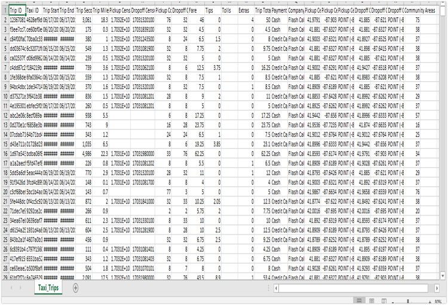

# chicago-taxi-trip-analysis
In this project we have analysed chicago taxi trip dataset using MapReduce , Hive, Spark and BigQuery in Google Cloud Platform(GCP).

# Dataset
Taxicabs in Chicago, Illinois, are operated by private companies and licensed by the city.
There are about seven thousand licensed cabs operating within the city limits.
This dataset  includes taxi trips from 2013 to the present, reported to the City of Chicago in its role as a regulatory agency. To protect privacy but allow for aggregate analyses, the Taxi ID is consistent for any given taxi medallion number but does not show the number, Census Tracts are suppressed in some cases, and times are rounded to the nearest 15 minutes.
Dataset Source: City of Chicago
This dataset is publicly available for anyone to use under the following terms provided by the Dataset Source
https://data.cityofchicago.org
This dataset has about 185,666,648 instances and 23 attributes.
- Trip Id
- Taxi Id
- Trip Start Timestamp
-  Trip End Timestamp
-  Trip Seconds
-  Trip Miles
- Pickup Census Tract
- Dropoff Census Tract
- Pickup Community Area
- Dropoff Community Area
- Fare
- Tips
- Tolls
- Extras
- Trip Total
- Payment Type
- Company
- Pickup Centroid Latitude
- Pickup Centroid Longitude
- Pickup Centroid Location
- Dropoff Centroid Latitude
- Dropoff Centroid Longitude
- Dropoff Centroid Location

# Problem Statement
We mainly focused on this four problem statements
- Categorizing number of trips and average mph of each hour of the day
- Finding the total number of trips made in each year from 2013 to the present
- Finding time elapses between rides.
- Predicting the demand for taxis in Chicago

# Implementation
## Categorizing number of trips and average mph of each hour of the day 
- This Query was implemented using Hive in GCP my creating a cluster and assigning a job to it.
- This will result in giving the total number of trips in each hour of the day
with its average speed in mph.
- Our result will have 3 columns – hour-of-day (which is extracted from
trip_start_timestamp), num-trips (total number of trips in each hour of the
day), avg_mph ( average speed calculated in miles per hour.
## Finding the total number of trips made in each year from 2013 to the present.
- This query was implemented using Map-reduce programming
- We can estimate the total number of trips made in a year and this will tell
us if taxi demand is increasing or decreasing over the years.
- Our result will have 2 columns – year (the year of the trips) and num_trips
(total number of trips in that year).
## Finding time elapses between rides.
- This query was implemented using Spark
-  This query will be to find the length of the break that the driver had before
each trip started.
- Our result will have 4 columns – taxi-id, trip_start_timestamp,
trip_end_timestamp, break.
## Predicting the demand for taxis in Chicago
- This query was implemented using Big query in GCP.
-  We can predict the demand for taxis using number trips based on trip date,
time.
-  Our result will include 2 columns – trip_date (date of the trip) and
avg_num_trips(average number of trips on that day).

# Results
## Number of trips per year
 .png)
## Average miles per hour
 
## Analysing Demand for Taxis
 
## Time Elapses between the trips
 
## Comparision
We have performed Query 3 in both Map-reduce and Big Query. But for that query we have noticed that Big Query took less time when compared to Map-reduce job.
 

